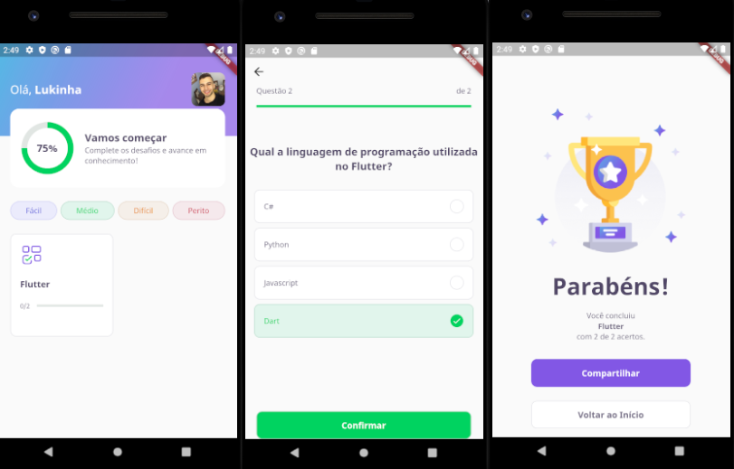

# NLW-5 (Trilha Flutter)
Aplicação desenvolvida durante a quarta edição da Next Level Week, organizada pela Rocketseat. Um evento que dura uma semana toda, voltada pra o desenvolvimento profissional dos participantes, em busca de um próximo nível. Aulas são soltadas todo dia de segunda a sexta e todo conteúdo é retirado do ar no final do domingo.

Desenvolvemos do zero uma aplicação mobile de um quiz que busca as informações em um json dentro da pasta do projeto.

# O que eu tirei de aprendizado durante essa semana:
- Entendi mais sobre como funciona a estruturação de um projeto feito em Flutter.
- Entendi como funciona a renderização de uma aplicação Flutter.
- Aprendi a utilizar a navegação dentro do Flutter.
- Entendi mais sobre a gerência dos estados.
- Entendi que Flutter é um framework muito versátil e poderoso nas mãos de quem o domina, visto que é uma tecnologia multiplataforma e "facilitadora" na criação de interfaces gráficas.
